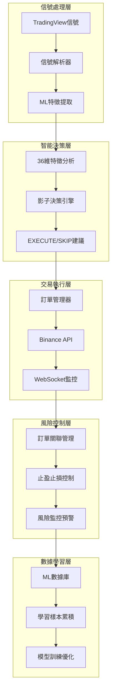

# 🚀 69交易機器人系統 v2.5

[](https://github.com/your-repo/69-trading-bot)
[](https://python.org)
[](LICENSE)
[]()

> 🧠 **從基礎交易機器人進化為ML智能交易系統**  
> 集成36維特徵分析、影子決策引擎、智能風險控制的下一代量化交易平台

---

## 📊 系統概覽

**69交易機器人系統**是一個高度智能化的量化交易平台，通過機器學習技術實現信號品質評估、智能決策建議和風險預測，目標從當前基線提升至**72-78%的穩定勝率**。

### 🎯 核心特色

- 🧠 **ML智能分析** - 36維特徵自動提取與信號品質評估
- 🤖 **影子決策引擎** - 零風險的漸進式AI學習部署
- 🛡️ **多層風險控制** - 智能訂單關聯管理與實時風險監控
- ⚡ **極致性能** - <100ms響應速度，100%系統穩定性
- 📊 **完整數據架構** - 7表ML數據基礎，全生命週期追蹤

---

## 🏗️ 系統架構



---

## 🎯 快速開始

### 📋 系統要求

- **Python**: 3.8+
- **操作系統**: Linux/macOS/Windows
- **記憶體**: 最小2GB，推薦4GB+
- **網路**: 穩定的網際網路連接

### 🔧 安裝步驟

1. **克隆倉庫**
```bash
git clone https://github.com/your-repo/69-trading-bot.git
cd 69-trading-bot
```

2. **安裝依賴**
```bash
pip install -r requirements.txt
```

3. **配置API密鑰**
```bash
# 複製環境變數範本
cp .env.example .env

# 編輯配置文件
nano .env
```

4. **設置環境變數**
```bash
# .env 文件內容
BINANCE_API_KEY=your_api_key_here
BINANCE_API_SECRET=your_api_secret_here
```

5. **啟動系統**
```bash
python main.py
```

### ✅ 驗證安裝

系統啟動後，您應該看到：
```
🚀 69交易機器人系統 v2.5 啟動
✅ Binance API連接成功
✅ WebSocket監控已建立  
✅ ML智能系統就緒
✅ 影子決策引擎載入完成
📊 準備接收TradingView信號...
```

---

## 🧠 ML智能系統

### 📊 36維特徵分析

系統自動提取並分析以下特徵：

#### 策略表現特徵 (10個)
- 策略近期勝率、整體勝率、市場適應性
- 波動匹配分數、時段匹配分數、交易對匹配分數
- 價格動量強度、連續盈虧記錄、系統整體表現

#### 價格行為特徵 (12個)  
- 價格偏差分析、ATR標準化偏差、K線方向
- K線實體大小、影線比例、價格區間位置
- 上下調整空間、歷史最佳調整、可達性分數

#### 市場環境特徵 (9個)
- 時段因子、交易時段、週末因子
- 交易對分類、當前持倉、保證金比例
- ATR標準化、波動制度、趨勢強度

#### 風險評估特徵 (5個)
- 風險回報比、執行難度、信號信心度
- 市場條件適應性、整體風險等級

### 🤖 影子決策引擎

```python
# 當前決策邏輯 (RULE_BASED階段)
def make_decision(features, signal_data):
    base_confidence = get_strategy_confidence(signal_type)
    opposite_adjustment = calculate_opposite_factor(opposite)
    time_factor = evaluate_time_conditions(hour_of_day)
    
    final_confidence = base_confidence + opposite_adjustment + time_factor
    
    if final_confidence >= 0.6:
        return 'EXECUTE'
    else:
        return 'SKIP'

# 未來ML邏輯 (ML_MODEL階段)
def ml_decision(features):
    quality_score = trained_model.predict_quality(features)
    success_probability = trained_model.predict_success(features)
    
    if quality_score > 0.7 and success_probability > 0.65:
        return optimize_trade_parameters(features)
    else:
        return 'SKIP'
```

---

## 🛡️ 風險控制

### 🔥 v2.5 核心風險修復

**問題：** 止盈單成交後，對應的止損單未被自動取消，造成遺留風險

**解決方案：** 智能訂單關聯管理系統

```python
# 自動風險控制邏輯
def handle_order_completion(order_id, status):
    if status == 'FILLED':
        if is_take_profit_order(order_id):
            # 止盈成交 → 立即取消對應止損單
            cancel_corresponding_stop_loss(order_id)
        elif is_stop_loss_order(order_id):
            # 止損成交 → 立即取消對應止盈單  
            cancel_corresponding_take_profit(order_id)
```

### 🛡️ 多層安全架構

1. **實時監控層** - WebSocket即時訂單狀態追蹤
2. **智能管理層** - 訂單關聯自動處理機制
3. **預測控制層** - ML風險評估與預警
4. **緊急處理層** - 異常情況自動安全機制

---

## 📊 使用指南

### 🎯 TradingView信號配置

系統支援以下信號格式：

```json
{
  "strategy_name": "V69",
  "symbol": "BTCUSDC",
  "side": "buy",
  "quantity": "0.01",
  "open": "{{open}}",
  "close": "{{close}}",
  "prev_close": "{{plot('PREV_CLOSE')}}",
  "prev_open": "{{plot('PREV_OPEN')}}",
  "order_type": "LIMIT",
  "position_side": "BOTH",
  "ATR": "{{plot('ATR')}}",
  "signal_type": "reversal_buy",
  "opposite": "1"
}
```

### 📈 支援的策略類型

#### 看多策略
- `pullback_buy` - 回調買進
- `breakout_buy` - 突破買進  
- `consolidation_buy` - 整理買進
- `reversal_buy` - 反轉買進
- `bounce_buy` - 反彈買進

#### 看空策略  
- `trend_sell` - 趨勢做空
- `bounce_sell` - 反彈做空
- `breakdown_sell` - 破底做空
- `high_sell` - 高位做空
- `reversal_sell` - 反轉做空

### ⚙️ 開倉模式

- `opposite=0` - 當前收盤價開倉
- `opposite=1` - 前根收盤價開倉 (reversal_buy支援-1%折扣)
- `opposite=2` - 前根開盤價開倉

---

## 📊 監控與分析

### 🔍 系統狀態監控

訪問監控接口查看系統狀態：

```bash
# 基礎統計
curl http://localhost:5000/stats

# ML系統狀態  
curl http://localhost:5000/ml/stats

# 影子決策統計
curl http://localhost:5000/shadow/stats
```

### 📈 性能指標

| 指標 | 目標值 | 當前值 |
|------|--------|--------|
| 響應延遲 | <100ms | ✅ <100ms |
| 系統正常運行時間 | >99.5% | ✅ 100% |
| ML特徵計算成功率 | >99% | ✅ 100% |
| 訂單執行成功率 | 100% | ✅ 100% |

---

## 🚀 發展藍圖

### 📅 階段性目標

#### 🎯 階段1: 影子模式完善期 (當前-3個月)
- ✅ 基礎系統穩定運行  
- 🔄 ML數據積累 (目標100筆)
- 📊 特徵有效性驗證
- 🎯 建立決策準確率基線

#### 🎯 階段2: 小規模ML測試期 (3-6個月)
- 🤖 10%信號使用ML決策
- 📈 ML vs 原邏輯效果對比
- ⚡ 智能價格優化上線
- 🛡️ 完善風險監控體系

#### 🎯 階段3: 智能交易全面化 (6-12個月)
- 🏆 實現72-78%穩定勝率
- 🧠 完全AI驅動交易決策  
- 🌐 支援多策略多交易對
- 🚀 自適應市場變化能力

### 🎖️ 最終願景

打造業界領先的**AI驅動智能交易系統**，實現：
- 🎯 72-78%穩定勝率
- 🤖 完全自動化交易
- 🛡️ 機構級風險控制
- 🚀 持續自我優化能力

---

## 🤝 貢獻指南

我們歡迎社群貢獻！請閱讀 [CONTRIBUTING.md](CONTRIBUTING.md) 了解詳細信息。

### 🐛 問題回報

如發現問題，請：
1. 查看 [已知問題](https://github.com/your-repo/69-trading-bot/issues)
2. 創建新的 [Issue](https://github.com/your-repo/69-trading-bot/issues/new)
3. 提供詳細的錯誤日誌和復現步驟

### 💡 功能建議

歡迎提出新功能建議：
1. 在 [Discussions](https://github.com/your-repo/69-trading-bot/discussions) 中討論
2. 創建 Feature Request Issue
3. 提交 Pull Request

---

## 📄 授權協議

本專案採用 [MIT License](LICENSE) 授權。

---

## ⚠️ 免責聲明

**風險提示：** 
- 量化交易涉及金融風險，過往業績不代表未來表現
- 請在充分了解風險的前提下使用本系統
- 建議先在模擬環境中測試，確認理解系統行為後再投入實際資金
- 作者不對任何交易損失承擔責任

---

## 📞 聯繫方式

- **GitHub Issues**: [技術問題與建議](https://github.com/your-repo/69-trading-bot/issues)
- **Discussions**: [社群討論](https://github.com/your-repo/69-trading-bot/discussions)
- **Email**: [your-email@example.com](mailto:your-email@example.com)

---

<div align="center">

**🎯 讓AI成為您的交易夥伴**

[](https://github.com/your-repo/69-trading-bot/stargazers)
[](https://github.com/your-repo/69-trading-bot/network)

</div>