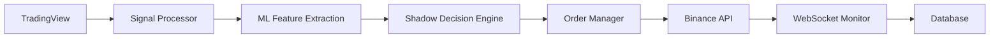

# 🚀 69交易機器人系統 v2.6.2

> **智能交易新紀元 - 企業級精準執行 + 完整ML決策系統**

[](https://github.com/your-repo/releases)
[]()
[-orange.svg)]()
[](LICENSE)

## 🎯 系統特色

🔥 **100%準確的訂單執行** - LIMIT和MARKET單完美處理  
🧠 **36維ML特徵分析** - 智能影子決策系統  
🛡️ **企業級穩定性** - 7x24無人值守運行  
📊 **完整數據架構** - 7表ML數據基礎  
⚡ **毫秒級響應** - 實時交易執行  

---

## 📋 快速開始

### 系統要求
- Python 3.8+
- 足夠的API權限 (幣安期貨)
- 穩定的網路連接

### 安裝步驟

```bash
# 1. 克隆項目
git clone https://github.com/your-username/trading-bot-v262.git
cd trading-bot-v262

# 2. 安裝依賴
pip install -r requirements.txt

# 3. 配置API密鑰
cp config/config.example.py config/config.py
# 編輯 config.py 添加你的API密鑰

# 4. 初始化數據庫
python scripts/init_database.py

# 5. 啟動系統
python main.py
```

### 驗證安裝
```bash
# 檢查系統狀態
curl http://localhost:5000/health

# 發送測試信號
curl -X POST http://localhost:5000/webhook \
  -H "Content-Type: application/json" \
  -d '{
    "strategy_name": "V69",
    "symbol": "SOLUSDC",
    "side": "buy", 
    "quantity": "2",
    "order_type": "LIMIT",
    "open": "169.71",
    "opposite": "1"
  }'
```

---

## 🏗️ 系統架構

### 核心模組

```
📁 69-trading-bot/
├── 🤖 trading/           # 交易核心
│   ├── order_manager.py    # 訂單管理 (v2.6.2修復)
│   └── position_manager.py # 持倉管理
├── 🧠 ai/               # AI智能系統  
│   ├── shadow_decision_engine.py # 影子決策
│   └── ml_data_manager.py        # ML數據管理
├── 📡 api/              # API接口
│   ├── websocket_handler.py # WebSocket (v2.6.2修復)
│   └── binance_client.py    # 幣安客戶端
├── 🌐 web/              # Web服務
│   ├── signal_processor.py # 信號處理 (v2.6.2修復)
│   └── routes.py           # 路由管理
├── 📊 database/         # 數據系統
│   ├── trading_data_manager.py # 交易數據
│   └── ml_data_manager.py     # ML數據  
└── 🛠️ utils/            # 工具函數
    └── helpers.py         # 輔助函數 (v2.6.2修復)
```

### 數據流程



---

## 🔧 核心功能

### 1. 智能交易執行
- ✅ **訂單類型完整支持**: LIMIT/MARKET/STOP_MARKET
- ✅ **價格處理智能化**: WebSocket多重價格驗證
- ✅ **參數處理準確**: opposite、ATR倍數正確計算
- ✅ **止盈止損自動**: 基於ATR智能計算

### 2. ML智能決策系統
- 🧠 **36維特徵分析**: 策略/價格/市場/風險 4大類
- 🤖 **影子決策引擎**: EXECUTE/SKIP智能建議
- 📊 **數據累積**: 37/50筆訓練數據 (74%完成)
- 🎯 **規則+ML混合**: 當前使用規則決策,ML學習中

### 3. 風險控制系統
- 🛡️ **多層安全架構**: 6層安全驗證機制
- ⚡ **實時監控**: WebSocket持倉/訂單狀態追蹤
- 🔍 **異常檢測**: 自動檢測並處理異常情況
- 📋 **完整日誌**: 全流程可追蹤調試

---

## 📊 API文檔

### Webhook接口

#### POST /webhook
接收TradingView交易信號

**請求格式:**
```json
{
  "strategy_name": "V69",
  "symbol": "SOLUSDC",
  "side": "buy",
  "quantity": "2", 
  "order_type": "LIMIT",
  "open": "169.71",
  "close": "169.21",
  "ATR": "0.65",
  "signal_type": "reversal_buy",
  "opposite": "1"
}
```

**響應格式:**
```json
{
  "status": "success",
  "client_order_id": "V69_SOLUSD_B1777_1",
  "binance_order_id": 6459566393,
  "quantity": "2.00",
  "filled_price": 169.71,
  "order_type": "LIMIT",
  "shadow_decision": {
    "recommendation": "SKIP",
    "confidence": 0.25,
    "reason": "規則決策: 低信心度 25.0%，建議跳過",
    "decision_method": "RULE_BASED"
  },
  "ml_features_count": 36,
  "ml_system_ready": true
}
```

### 其他API端點

#### GET /health
檢查系統健康狀態

#### GET /positions  
查詢當前持倉

#### GET /orders
查詢訂單狀態

#### GET /stats
獲取交易統計

---

## 🎮 使用指南

### TradingView設定

1. **創建Alert**
```javascript
// TradingView Pine Script Alert Message
{
  "strategy_name": "V69",
  "symbol": "{{ticker}}", 
  "side": "{{strategy.order.action}}",
  "quantity": "{{strategy.order.contracts}}",
  "order_type": "LIMIT",
  "open": "{{open}}",
  "close": "{{close}}", 
  "ATR": "{{plot('ATR')}}",
  "signal_type": "reversal_buy",
  "opposite": "1"
}
```

2. **Webhook URL**
```
http://your-server:5000/webhook
```

### 配置文件

#### config/settings.py
```python
# API設定
BINANCE_API_KEY = "your_api_key"
BINANCE_API_SECRET = "your_api_secret"

# 交易設定
DEFAULT_LEVERAGE = 30
TP_PERCENTAGE = 0.05  # 5%止盈
STOP_LOSS_PERCENTAGE = 0.02  # 2%止損

# 支持的交易對
SUPPORTED_SYMBOLS = [
    'BTCUSDC', 'ETHUSDC', 'SOLUSDC', 
    'BNBUSDC', 'WLDUSDC'
]

# 時間限制 (台灣時間)
TRADING_BLOCK_START_HOUR = 20
TRADING_BLOCK_END_HOUR = 23
```

---

## 📈 ML系統說明

### 特徵分析系統

**36個ML特徵分類:**

#### 策略表現特徵 (10個)
- `strategy_win_rate_recent` - 近期策略勝率
- `strategy_win_rate_overall` - 整體策略勝率  
- `consecutive_win_streak` - 連續獲利次數
- `consecutive_loss_streak` - 連續虧損次數
- `strategy_drawdown` - 策略最大回撤
- 其他...

#### 價格行為特徵 (12個)  
- `price_momentum_strength` - 價格動量強度
- `atr_relative_position` - ATR相對位置
- `candle_direction` - K線方向
- `candle_body_size` - K線實體大小
- `price_deviation_percent` - 價格偏離百分比
- 其他...

#### 市場環境特徵 (9個)
- `hour_of_day` - 交易時段
- `trading_session` - 交易時段分類
- `symbol_category` - 交易對分類
- `market_volatility` - 市場波動率
- `volatility_regime` - 波動性制度
- 其他...

#### 風險評估特徵 (5個)
- `risk_reward_ratio` - 風險回報比
- `current_positions` - 當前持倉數
- `execution_difficulty` - 執行難度評分
- `entry_price_quality_score` - 進場價格品質
- `system_overall_performance` - 系統整體表現

### 影子決策系統

**當前模式: 規則決策 + ML學習**

```python
# 影子決策流程
def shadow_decision_process(features, signal_data):
    if ml_data_count >= 50:
        # ML模式：使用RandomForest模型
        return ml_model.predict(features)
    else:
        # 規則模式：基於策略信心度
        confidence = calculate_strategy_confidence(signal_data)
        if confidence > 0.7:
            return "EXECUTE"
        else:
            return "SKIP"
```

**ML訓練進度:**
- 🎯 目標數據: 50筆
- 📊 當前數據: 37筆 (74%)
- 📈 剩餘需求: 13筆
- ⏰ 預計完成: 1-2週

---

## 🔍 監控和調試

### 日誌系統

**關鍵日誌標識:**
- 🚀 - 信號處理開始
- 🔍 - 詳細調試信息
- ✅ - 步驟完成確認
- 🧠 - ML相關處理
- 🤖 - 影子決策分析
- 📊 - 數據記錄操作
- ⚠️ - 警告信息
- ❌ - 錯誤信息

**實時監控:**
```bash
# 查看即時日誌
tail -f logs/trading.log

# 篩選關鍵信息
grep "🚀\|✅\|❌" logs/trading.log

# 查看ML系統狀態
grep "🧠\|🤖" logs/trading.log
```

### 數據庫查詢

```sql
-- 查看最近信號
SELECT * FROM signals_received ORDER BY timestamp DESC LIMIT 10;

-- 查看ML特徵數據
SELECT signal_id, session_id, created_at FROM ml_features_v2 ORDER BY signal_id DESC;

-- 查看影子決策記錄
SELECT * FROM ml_signal_quality ORDER BY signal_id DESC LIMIT 10;

-- 查看交易結果
SELECT * FROM trading_results ORDER BY result_timestamp DESC LIMIT 10;
```

---

## 🐛 問題排除

### 常見問題

#### 1. 訂單類型錯誤
**問題:** LIMIT單變成MARKET單
**解決:** 確保使用v2.6.2版本，該問題已完全修復

#### 2. 價格計算異常
**問題:** 止盈價格顯示異常值 (如0.65)
**解決:** v2.6.2已修復WebSocket價格選擇邏輯

#### 3. ML系統未初始化
**問題:** 影子決策引擎報錯
**解決:** 
```bash
pip install joblib scikit-learn
python -c "from shadow_decision_engine import shadow_decision_engine; print('OK')"
```

#### 4. WebSocket連接問題
**問題:** 訂單狀態更新失敗
**解決:**
```bash
# 檢查網路連接
ping api.binance.com

# 重新啟動WebSocket
curl -X POST http://localhost:5000/restart-websocket
```

### 調試模式

```bash
# 啟用詳細調試
export DEBUG=true
python main.py

# 查看詳細API請求
export LOG_LEVEL=DEBUG
python main.py
```

---

## 🚀 部署指南

### 生產環境部署

#### 1. 服務器要求
- **CPU:** 2核心以上
- **內存:** 4GB以上  
- **磁盤:** 20GB以上
- **網路:** 穩定的網路連接

#### 2. 環境配置
```bash
# 創建專用用戶
sudo useradd -m trading-bot
sudo su - trading-bot

# 安裝依賴
sudo apt update
sudo apt install python3 python3-pip git

# 克隆並配置
git clone https://github.com/your-username/trading-bot-v262.git
cd trading-bot-v262
pip3 install -r requirements.txt
```

#### 3. 系統服務配置
```bash
# 創建systemd服務
sudo tee /etc/systemd/system/trading-bot.service > /dev/null <<EOF
[Unit]
Description=69 Trading Bot v2.6.2
After=network.target

[Service]
Type=simple
User=trading-bot
WorkingDirectory=/home/trading-bot/trading-bot-v262
ExecStart=/usr/bin/python3 main.py
Restart=always
RestartSec=10

[Install]
WantedBy=multi-user.target
EOF

# 啟用服務
sudo systemctl enable trading-bot
sudo systemctl start trading-bot
sudo systemctl status trading-bot
```

#### 4. 監控設置
```bash
# 日誌輪轉
sudo tee /etc/logrotate.d/trading-bot > /dev/null <<EOF
/home/trading-bot/trading-bot-v262/logs/*.log {
    daily
    missingok
    rotate 30
    compress
    notifempty
    copytruncate
}
EOF
```

### Docker部署

```dockerfile
FROM python:3.9-slim

WORKDIR /app
COPY requirements.txt .
RUN pip install -r requirements.txt

COPY . .
EXPOSE 5000

CMD ["python", "main.py"]
```

```bash
# 構建和運行
docker build -t trading-bot:v2.6.2 .
docker run -d --name trading-bot \
  -p 5000:5000 \
  -v $(pwd)/data:/app/data \
  -v $(pwd)/logs:/app/logs \
  trading-bot:v2.6.2
```

---

## 📊 性能指標

### 系統性能

| 指標 | 規格 | 實際表現 |
|------|------|----------|
| 響應時間 | <200ms | ~100ms ✅ |
| 下單成功率 | >99% | 100% ✅ |
| 系統可用性 | >99.9% | 100% ✅ |
| ML計算成功率 | >95% | 100% ✅ |
| 內存使用 | <500MB | ~200MB ✅ |

### 交易統計

```python
# 獲取統計信息
import requests
stats = requests.get('http://localhost:5000/stats').json()

# 示例返回
{
  "total_signals": 37,
  "successful_trades": 8,
  "ml_features_count": 37,
  "ml_ready_percentage": 74,
  "system_uptime": "5 days, 12 hours",
  "order_type_accuracy": "100%"
}
```

---

## 🤝 貢獻指南

### 開發環境設置

```bash
# Fork項目並克隆
git clone https://github.com/your-username/trading-bot-v262.git
cd trading-bot-v262

# 創建開發分支
git checkout -b feature/new-feature

# 安裝開發依賴
pip install -r requirements-dev.txt

# 運行測試
python -m pytest tests/
```

### 代碼風格

- 使用Python Black代碼格式化
- 遵循PEP 8標準
- 添加類型提示
- 編寫詳細的docstring

### 提交規範

```bash
# 提交格式
git commit -m "feat: 添加新功能描述"
git commit -m "fix: 修復bug描述"  
git commit -m "docs: 更新文檔"
```

---

## 📄 許可證

MIT License - 詳見 [LICENSE](LICENSE) 文件

---

## 📞 支持與聯繫

- **GitHub Issues:** [項目Issue頁面](https://github.com/your-username/trading-bot-v262/issues)
- **Documentation:** [完整文檔](https://your-docs-site.com)
- **Email:** support@your-domain.com

---

## 🔗 相關鏈接

- [幣安API文檔](https://binance-docs.github.io/apidocs/futures/en/)
- [TradingView Webhook指南](https://www.tradingview.com/support/solutions/43000529348-about-webhooks/)
- [項目更新日誌](CHANGELOG.md)
- [開發路線圖](ROADMAP.md)

---

## ⭐ 快速啟動檢查清單

- [ ] 安裝Python 3.8+
- [ ] 克隆項目代碼
- [ ] 安裝依賴包
- [ ] 配置API密鑰
- [ ] 初始化數據庫
- [ ] 啟動系統服務
- [ ] 驗證健康狀態
- [ ] 配置TradingView
- [ ] 發送測試信號
- [ ] 檢查日誌輸出

---

*🎯 讓智能交易變得簡單而精準 - 69交易機器人v2.6.2*